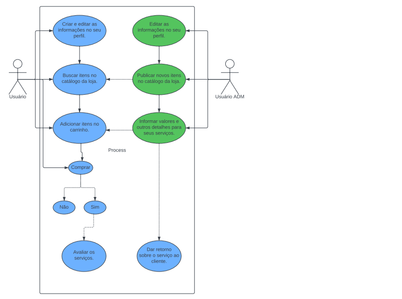

# Especificações do Projeto

A definição exata do problema e os pontos mais relevantes a serem tratados neste projeto foi consolidada com a participação dos usuários em um trabalho de imersão feito pelos membros da equipe a partir da observação dos usuários em seu local natural e por meio de entrevistas. Os detalhes levantados nesse processo foram consolidados na forma de personas e histórias de usuários.

## Personas

# Eustaquio Motta
Idade: 66
Ocupação: Aposentado
Localidade: Belo Horizonte, MG
### Aplicativos:
- Instagram;
- Facebook;
- Whatsapp.
### Motivações:
- Modernizar e expandir o seu negócio;
- Alcançar o maior número possível de pessoas;
- Desenvolver parcerias com pessoas entusiastas da área para alavancar o seu empreendimento.
### Frustrações:
- Dificuldade de encontrar público a procura de produtos de colecionador em sua cidade;
- Baixo alcance ao público alvo;
- Pouco espaço físico em sua loja para poder expor os seus produtos a venda.
### Hobbies, resumo e história:
-Estaquio colecionou itens de esporte durante toda sua vida, aos 45 anos decidiu expandir a ideia e resolveu abrir uma pequena loja em casa para vender e adquirir novas peças.

# Enzo Guttemberg
Idade: 28
Ocupação: Engenheiro elétrico
Localidade: Jaconia, BA
### Aplicativos:
- Facebook;
- Linkedin;
- Aplicativos de banco;
- Whatsapp;
- Instagram;
- Tiktok;
- Twitter.
### Motivações:
- Aumentar sua coleção de futebol da época de seu falecido avô;
- Dar continuidade a tradição da família que foi passada de geração.
### Frustrações:
- Não consegue achar camisetas autênticas com facilidade;
- Mesmo podendo pagar um valor alto por cada produto, Enzo não consegue achar a maioria das camisetas que faltam para a sua coleção.
### Hobbies, resumo e história:
- Enzo herdou a paixão pelo ftebol do seu pai, que herdou de seu avô;
- Desde novo ele segue aumentando a coleção que seu avô deixou após seu falecimento;
- Ir ao Estádio de Futebol com seu pai aos finais de semana.

# Francisco Fagundes
Idade: 50
Ocupação: Jornalista
Localidade: Rio de Janeiro
### Aplicativos:
- Facebook;
- Whatsapp;
- Instagram.
### Motivações:
- Francisco acredita que pode ser bem sucedido se colocar sua coleção de camisetas de futebol à venda na internet;
- Francisco quer alcançar pessoas que entendam que os produtos carregam sua história e compreendam o preço exigido por cada peça.
### Frustrações:
- Dificuldade em passar credibilidade ao público através de sites de venda.
### Hobbies, resumo e história:
- Francisco acompanhou a história do futebol desde novo, cursou jornalismo e se especializou em jornalismo esportivo;
- Ao longo da vida fez uma grande coleção de itens de futebol e agora sente que está na hora de vender esses pedacinhos de história para garantir sua aposentadoria.

# Clara Rezende
Idade: 26
Ocupação: Corretora
Localidade: Rio Grande do Sul, RS
### Aplicativos:
- Facebook;
- Whatsapp;
- Instagram;
- Twitter.
### Motivações:
- Dar uma camisa de futebol ao seu namorado;
- Ter confiança que o produto irá ser entregue;
- Ter confiança que o produto de colecionador não vai ser falso ou de má qualidade.
### Frustrações:
- Dificuldade para encontrar produtos colecionáveis/raros de futebol na internet;
- Incerteza se o produto vai ser entregue e se o produto é original.
### Hobbies, resumo e história:
- Clara é amante do futebol, gosta de assistir jogos de futebol e torcer para seu time do coração.

# Arthur Souza
Idade: 45
Ocupação: Mecânico, trabalha em diversas concessionárias de carros.
### Aplicativos:
- Facebook;
- Whatsapp.
### Motivações:
- Como é ano de copa do mundo e Arthur é muito supersticioso, o mesmo gostaria de assistir os jogos da seleção vestindo a camisa da copa de 2002;
- Tem o desejo de poder presentear membros de sua família com o mesmo produto, para poderem torcer juntos para a seleção.
### Frustrações:
- Muita dificuldade para encontrar essa camisa a venda na internet ou no varejo de sua cidade;
- Pouca qualidade e disponibilidade dessa camisa, pois é um item raro.
### Hobbies, resumo e história:
- Arthur gosta de jogar futebol aos finais de semana com os amigos e também de assistir aos jogos.

# Marcelo Falcão
Idade: 27
Ocupação: Youtuber e influenciador digital.
Localidade: São Paulo, SP
### Aplicativos:
- Facebook;
- Whatsapp;
- Youtube;
- Instagram.
### Motivações:
- Atingir 10 milhões de seguidores;
- Deseja ter repercursão no seu canal com reviews de produtos esportivos raros como camisas/chuteiras/bonés.
- Investir na compra de produtos exclusivos e raros para poder obter lucro na venda dos mesmos futuramente.
### Frustrações:
- Haters, que entram no seu canal para falar da má qualidade de alguns de seus produtos;
- Não ter confiança de fazer investimentos na internet por fraudes em compras.
### Hobbies, resumo e história:
- Frequentador de festas e baladas;
- Aptidão musical apresentada quando Marcelo era criança e foi presenteado com um violão.

## Histórias de Usuários

Com base na análise das personas forma identificadas as seguintes histórias de usuários:

|EU COMO... `PERSONA`| QUERO/PRECISO ... `FUNCIONALIDADE` |PARA ... `MOTIVO/VALOR`                 |
|--------------------|------------------------------------|----------------------------------------|
|Empresário Eustaqui Motta  | Aumentar a sua exposição no mercado de camisas raras de futebol | Expandir o seu alcance, para que os seus produtos alcancem uma maior quantidade de potenciais clientes.   |
|Empresário Eustaquio Motta | Quero criar um portal para poder expor todos os meus produtos que estão para venda | Devido ao espaço limitado em sua loja física, muitos produtos que ele quer comercializar acabam não recebendo o destaque adequado para a venda dos mesmos. |
| Cliente Enzo Guttemberg | Quero Continuar a tradição da família de colecionar artigos de roupas de futebol da época de seu avô. | Manter a tradição de colecionador na família, ensinada pelo seu avô. |
| Cliente Enzo Guttemberg | Um portal de vendas que possa encontrar produtos exclusivos para poder expandir a sua coleção. | Aumentar a vaiedade de produtos em sua coleção. |
| Empresário Francisco Fagundes | Criar um portal de vendas on-line onde os clientes não precisem se preocupar com a originalidade ou a qualidade do produto. | Entrar no mercado de vendas de camisas raras, garantindo segurança para o consumidor, fornecendo garantia dos produtos e a sua genuinidade. |
| Cliente Clara Rezende | Poder apresentar o seu namorado com uma camisa de futebol rara do seu time de coração. | Agradar o seu cônjugue, escolher um presente que seja um gosto compartilhado entre ambas as partes. |
| Cliente Arthur Souza | Encontrar uma camiseta retro de futebol específica, de acesso muito limitado. | Poder assistir aos jogos da copa do mundo com esta camisa específica. |
| Cliente Arthur Souza | Presentear os membros de sua família com o mesmo produto para poderem torcer juntos pela seleção. | Satisfazer o seu desejo supersticioso, poder agradar os membros de sua família no momento de assistir os jogos. |
| Cliente Marcelo Falcão | Poder publicar na internet avaliações de camisas de futebol exclusivas de pouco acesso. | Gerar conteùdo em suas redes sociais, aumentar a margem de visualização do seu conteúdo. |
| Cliente Marcelo Falcão | Adquirir produtos raros com o intuito de vender novamente no futuro, por um preço mais elevado do que o que foi pago. | Investir na compra de camisas raras de futebol com o intuito de obter lucro no futuro. |

## Requisitos

As tabelas que se seguem apresentam os requisitos funcionais e não funcionais que detalham o escopo do projeto.

### Requisitos Funcionais

|ID    | Descrição do Requisito  | Prioridade |
|------|-----------------------------------------|----|
|RF-001| A aplicação deve ter uma homr page intuitiva e com o menu navegável. | ALTA | 
|RF-002| A aplicação deve ter os produtos destacados na página inicial, como forma de sugestão ao usuário. | ALTA |
|RF-003| A aplicação deve conter uma linguagem acessível para a maioria, com poucos termos técnicos.  | ALTA |
|RF-004| Os preços devem ser explícitos para todos, melhorando a confiabilidade. | ALTA |
|RF-005| A aplicação deve ter um breve resumo sobre quem somos. | MÉDIA |
|RF-006| A aplicação deve conter uma página sobre política de trocas e devoluções e como realizar essas instruções. | MÉDIA |
|RF-007| A aplicação deve conter um campo de busca para produtos. | MÉDIA |
|RF-008| A aplicação deve apresentar um catálogo de seus produtos disponíveis. | MÉDIA |
|RF-009| A aplicação deve apresentar uma área para cadastro e login de usuário. | ALTA |
|RF-010| A aplicação deve apresentar uma área de carrinho em que o usuário irá adicionar seus itens para realização da compra. | ALTA |
|RF-011| A aplicação deve apresentar um registro de pedidos do usuário. | MÉDIA |
|RF-012| A aplicação deve conter na página do usuário acesso aos seus dados cadastrados para futurações alterações. | BAIXA |
|RF-013| A aplicação deve conter uma área em que o usuário possa adicionar itens desejados para futuras compras. | BAIXA |

### Requisitos não Funcionais

|ID     | Descrição do Requisito  |Prioridade |
|-------|-------------------------|----|
|RNF-001| O site deve ser publicado em um ambiente acessível publicamente na Internet (Repl.it, GitHub Pages, Heroku).  | ALTA | 
|RNF-002| O site deverá ser responsivo permitido a visualização em um celular de forma adequada. |  ALTA |
|RNF-003| O site deve ter bom nível de contraste entre os elementos da tela em conformidade. | MÉDIA |
|RNF-004| O site deve ser compatível com as principais fontes e navegadores do mercado (Google Chrome, Firefox, Microsoft Edge). | ALTA |
|RNF-005| Uso de componentes gráficos (grids, barras de rolagem, menus). | ALTA |

## Restrições

O projeto está restrito pelos itens apresentados na tabela a seguir.

|ID| Restrição                                             |
|--|-------------------------------------------------------|
|01| O site deve ser publicado em um ambiente acessível publicamente na Internet (Repl.it, GitHub Pages, Heroku). |
|02| O site deverá ser responsivo permitindo a visualização em um celular de forma adequada. |
|03| O site deve ter bom nível de contraste entre os elementos da tela em conformidade. |

## Diagrama de Casos de Uso

